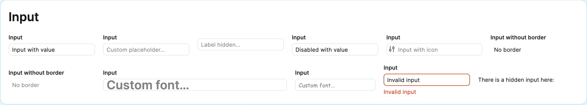

# FigmaKit Plugin UI Svelte

A comprehensive component library for Svelte-based Figma plugins, providing authentic Figma UI elements with Svelte 5 support. Built to deliver a familiar, high-quality experience that matches Figma's native interface.

## Quick Start

### Installation

```bash
npm install figmakit-plugin-ui-svelte
```

### Basic Setup

```svelte
<script lang="ts">
	import { Button, Input, Switch } from 'figmakit-plugin-ui-svelte';

	// Import required global styles
	import 'figmakit-plugin-ui-svelte/dist/css/resets.css';
	import 'figmakit-plugin-ui-svelte/dist/css/global.css';
</script>

<Button onclick={() => console.log('Clicked!')}>Click Me</Button>
```

### CSS Variable Autocomplete (VS Code)

Add to `.vscode/settings.json` for CSS variable autocomplete:

```json
{
	"cssVariables.lookupFiles": [
		"node_modules/figmakit-plugin-ui-svelte/dist/css/global.css",
		"node_modules/figmakit-plugin-ui-svelte/dist/css/resets.css",
		"node_modules/figmakit-plugin-ui-svelte/dist/css/figma-styles-for-testing.css"
	]
}
```

## Demo Page

Run `npm run dev` after cloning to see all components in action with usage examples.

---

## Components

### Button

Primary action component with multiple variants and states.


| Prop          | Type                                     | Default     | Description                 |
| ------------- | ---------------------------------------- | ----------- | --------------------------- |
| `variant`     | `'primary' \| 'secondary' \| 'tertiary'` | `'primary'` | Button style variant        |
| `size`        | `'default' \| 'large'`                   | `'default'` | Button size                 |
| `destructive` | `boolean`                                | `false`     | Applies destructive styling |
| `disabled`    | `boolean`                                | `false`     | Disables the button         |
| `icon`        | `string`                                 | `undefined` | SVG icon string             |
| `onclick`     | `(event: MouseEvent) => void`            | `undefined` | Click handler               |

```svelte
<Button variant="primary" onclick={() => console.log('Primary clicked')}>Primary Action</Button>
<Button variant="secondary" size="large" icon={IconAdjust}>Secondary</Button>
<Button variant="tertiary" destructive>Delete</Button>
```

### Input

Text input component with label, validation, and icon support.



| Prop           | Type      | Default                     | Description              |
| -------------- | --------- | --------------------------- | ------------------------ |
| `label`        | `string`  | _required_                  | Input label text         |
| `showLabel`    | `boolean` | `true`                      | Show/hide label visually |
| `placeholder`  | `string`  | `'Input something here...'` | Placeholder text         |
| `disabled`     | `boolean` | `false`                     | Disables the input       |
| `invalid`      | `boolean` | `false`                     | Shows error state        |
| `errorMessage` | `string`  | `'Error message'`           | Error message text       |
| `icon`         | `string`  | `undefined`                 | Left-side icon           |
| `borders`      | `boolean` | `true`                      | Show/hide borders        |
| `value`        | `string`  | `''`                        | Input value (bindable)   |

```svelte
<Input label="Email" placeholder="Enter your email" />
<Input label="Search" icon={IconAdjust} />
<Input label="Name" invalid errorMessage="Name is required" />
```

### Checkbox

Standard checkbox input with label support.


| Prop       | Type                     | Default     | Description              |
| ---------- | ------------------------ | ----------- | ------------------------ |
| `checked`  | `boolean`                | `false`     | Checked state (bindable) |
| `disabled` | `boolean`                | `false`     | Disables the checkbox    |
| `value`    | `string`                 | `undefined` | Form value               |
| `onchange` | `(event: Event) => void` | `undefined` | Change handler           |

```svelte
<Checkbox onchange={(e) => console.log('Changed:', e.target.checked)}>
	Enable notifications
</Checkbox>
<Checkbox checked disabled>Read-only option</Checkbox>
```

### Switch

Toggle switch component for binary options.


| Prop       | Type                     | Default     | Description             |
| ---------- | ------------------------ | ----------- | ----------------------- |
| `checked`  | `boolean`                | `false`     | Switch state (bindable) |
| `disabled` | `boolean`                | `false`     | Disables the switch     |
| `onchange` | `(event: Event) => void` | `undefined` | Change handler          |

```svelte
<Switch checked onchange={() => console.log('Toggled')}>Dark mode</Switch>
```

### Radio

Radio button component for single selection from a group.


| Prop       | Type                     | Default     | Description        |
| ---------- | ------------------------ | ----------- | ------------------ |
| `group`    | `string \| number`       | _required_  | Bound group value  |
| `value`    | `any`                    | _required_  | This radio's value |
| `disabled` | `boolean`                | `false`     | Disables the radio |
| `onchange` | `(event: Event) => void` | `undefined` | Change handler     |

```svelte
<script>
	let selectedOption = 'option1';
</script>

<Radio bind:group={selectedOption} value="option1">Option 1</Radio>
<Radio bind:group={selectedOption} value="option2">Option 2</Radio>
```

### Textarea

Multi-line text input component.


| Prop          | Type      | Default                     | Description               |
| ------------- | --------- | --------------------------- | ------------------------- |
| `label`       | `string`  | _required_                  | Textarea label            |
| `showLabel`   | `boolean` | `true`                      | Show/hide label visually  |
| `rows`        | `number`  | `2`                         | Number of visible rows    |
| `placeholder` | `string`  | `'Input something here...'` | Placeholder text          |
| `disabled`    | `boolean` | `false`                     | Disables the textarea     |
| `value`       | `string`  | `''`                        | Textarea value (bindable) |

```svelte
<Textarea label="Description" rows={4} placeholder="Enter description..." />
```

### IconButton

Compact button component for icons only.


| Prop       | Type                          | Default     | Description         |
| ---------- | ----------------------------- | ----------- | ------------------- |
| `icon`     | `string`                      | _required_  | SVG icon string     |
| `label`    | `string`                      | `undefined` | Accessibility label |
| `disabled` | `boolean`                     | `false`     | Disables the button |
| `onclick`  | `(event: MouseEvent) => void` | `undefined` | Click handler       |

```svelte
<IconButton icon={IconClose} label="Close" onclick={handleClose} />
```

### ToggleButton

Button that maintains pressed/unpressed state.


| Prop       | Type                         | Default     | Description             |
| ---------- | ---------------------------- | ----------- | ----------------------- |
| `checked`  | `boolean`                    | `false`     | Toggle state (bindable) |
| `disabled` | `boolean`                    | `false`     | Disables the button     |
| `icon`     | `string`                     | `undefined` | Optional icon           |
| `onchange` | `(checked: boolean) => void` | `undefined` | State change handler    |

```svelte
<ToggleButton onchange={(checked) => console.log('Toggled:', checked)}>Favorite</ToggleButton>
<ToggleButton icon={IconAdjust} />
```

### MultiMenu

Advanced dropdown menu with nested groups, single/multi-select, and actions.


| Prop                 | Type                       | Default     | Description                       |
| -------------------- | -------------------------- | ----------- | --------------------------------- |
| `groups`             | `MenuGroup[]`              | _required_  | Menu structure array              |
| `triggerType`        | `'button' \| 'select'`     | `'button'`  | Trigger button style              |
| `showSelectedValues` | `boolean`                  | `false`     | Display selected items in trigger |
| `icon`               | `string`                   | `undefined` | Trigger icon                      |
| `disabled`           | `boolean`                  | `false`     | Disables the menu                 |
| `onclick`            | `(action: string) => void` | `undefined` | Action click handler              |

```svelte
<MultiMenu
	groups={[
		{
			name: 'file',
			label: 'File',
			children: [
				{ label: 'New', action: 'new' },
				{ label: 'Open', action: 'open' }
			]
		}
	]}
	triggerType="select"
	showSelectedValues
/>
```

### Dialog

Modal dialog component with header and customizable content.


| Prop      | Type                     | Default     | Description                         |
| --------- | ------------------------ | ----------- | ----------------------------------- |
| `title`   | `string`                 | _required_  | Dialog title                        |
| `dialog`  | `HTMLDialogElement`      | `undefined` | Dialog element reference (bindable) |
| `onclose` | `(event: Event) => void` | `undefined` | Close handler                       |

```svelte
<script>
	let myDialog;
</script>

<Button onclick={() => myDialog?.showModal()}>Open Dialog</Button>

<Dialog bind:dialog={myDialog} title="Confirmation">
	<p>Are you sure you want to continue?</p>
	<Button onclick={() => myDialog?.close()}>Close</Button>
</Dialog>
```

### Disclosure

Collapsible sections with expand/collapse functionality.

_[Screenshot placeholder: Disclosure sections in expanded and collapsed states]_

| Prop       | Type      | Default | Description                  |
| ---------- | --------- | ------- | ---------------------------- |
| `multiple` | `boolean` | `false` | Allow multiple sections open |

**DisclosureItem Props:**

| Prop       | Type      | Default    | Description                       |
| ---------- | --------- | ---------- | --------------------------------- |
| `title`    | `string`  | _required_ | Section title                     |
| `expanded` | `boolean` | `false`    | Initial expanded state (bindable) |
| `section`  | `boolean` | `false`    | Bold section styling              |

```svelte
<Disclosure multiple>
	<DisclosureItem title="Section 1" expanded>Content for section 1</DisclosureItem>
	<DisclosureItem title="Section 2">Content for section 2</DisclosureItem>
</Disclosure>
```

### Icon

Flexible icon component for displaying SVG icons.

_[Screenshot placeholder: Various icons with different sizes and colors]_

| Prop    | Type      | Default     | Description                   |
| ------- | --------- | ----------- | ----------------------------- |
| `icon`  | `string`  | _required_  | SVG icon string               |
| `size`  | `number`  | `24`        | Icon size in pixels           |
| `color` | `string`  | `undefined` | CSS color variable            |
| `spin`  | `boolean` | `false`     | Continuous rotation animation |

```svelte
<Icon icon={IconAdjust} size={16} />
<Icon icon={IconCheck} color="--figma-color-icon-success" />
```

### Utility Components

**Label**: Text labels for form sections
**Type**: Typography component with size and weight variants  
**OnboardingTip**: Informational tips with icons

---

## Icons

The library includes essential Figma UI icons. You can also **copy SVG icons directly from Figma** and use them with the Icon component:

1. Select an icon in Figma
2. Copy as SVG (Cmd/Ctrl + C)
3. Use with Icon component: `<Icon icon={copiedSvgString} />`

### Built-in Icons

- `IconAdjust` - Settings/configuration
- `IconCheck` - Checkmark
- `IconChevronDown` / `IconChevronRight` - Navigation
- `IconCaretDown` / `IconCaretRight` - Disclosure indicators
- `IconClose` - Close/dismiss

```svelte
import {(IconAdjust, IconCheck)} from 'figmakit-plugin-ui-svelte';
```

--- ## Development

### Getting Started

```bash
git clone https://github.com/KaiMagnusMueller/figmakit-plugin-ui.git
cd figmakit-plugin-ui
npm install
npm run dev
```

Everything inside `src/lib` is the library, `src/routes` contains the demo page.

### Building & Publishing

```bash
# Build library
npm run package

# Build demo site
npm run build

# Publish to npm
npm publish
# or for beta releases
npm publish --tag beta
```

### Version Management

```bash
npm version patch      # 2.0.0 → 2.0.1
npm version minor      # 2.0.0 → 2.1.0
npm version major      # 2.0.0 → 3.0.0
npm version prerelease --preid=beta  # → 2.0.1-beta.1
```

---

## Contributing

Contributions are welcome! Please open an issue or submit a pull request for any suggestions or improvements.

## License

MIT License - see [LICENSE](./LICENSE) for details.

---

_Built on top of [figma-plugin-ds-svelte](https://github.com/thomas-lowry/figma-plugin-ds-svelte) - thanks to the original author!_
